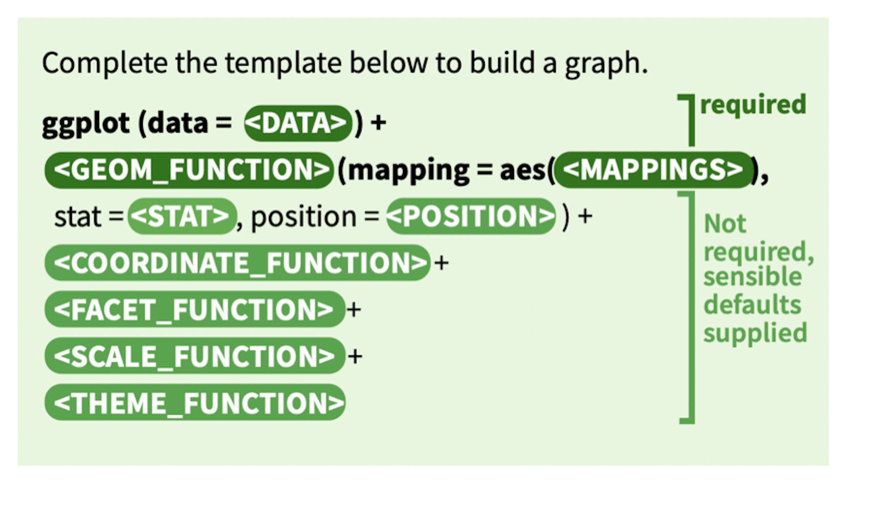
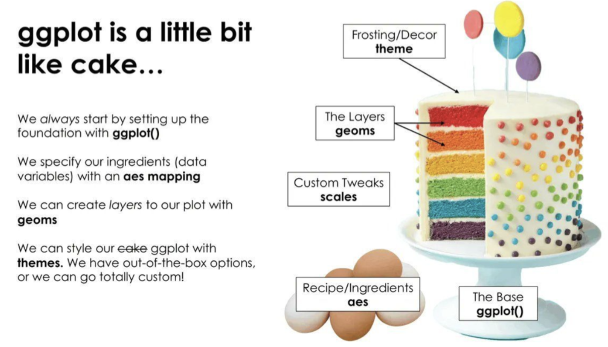
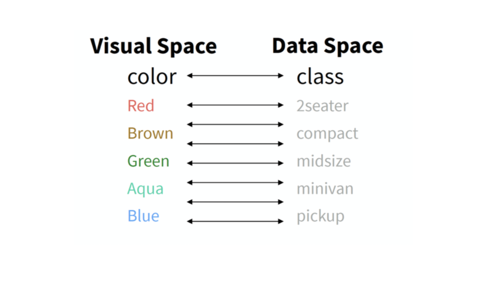

```{r}
#| message: false
#| warning: false
#| include: false
library(tidyverse)
library(showtext)
showtext_auto()
```

---

## 1 为什么用 ggplot2？

- `ggplot2` 是 R 中最流行的可视化包，背后有一套完整的理论体系：  **图形语法（Grammar of Graphics）**。
  
- 不需要记住每种图的专用函数，只需要掌握**一套统一的语法**，  就能画出散点图、折线图、柱状图、箱线图……

:::{.callout-tip}
`ggplot2` 的核心理念：一张图 = **数据** + **映射（aes）** + **几何图形（geom）**
:::

---

### 本节数据:ggplot2::mpg

```{r}
#| echo: true
#| code-fold: false
library(tidyverse)
data(mpg)
str(mpg)
```

---

| 变量 | 含义 |
|---|---|
| `displ` | 发动机排量（升）|
| `hwy` | 高速油耗（mpg）|
| `cty` | 城市油耗（mpg）|
| `class` | 车型 |
| `drv` | 驱动方式（f/r/4）|
| `cyl` | 气缸数 |

---

## 2 图层的理念

ggplot2 用 `+` 把多个**图层**叠加在一起，就像在画布上一层一层地添加元素。



---



---


```{r}
#| echo: true
#| code-fold: false

# 第1层：建立画布，指定数据和映射
ggplot(mpg, aes(x = displ, y = hwy))
```

:::{.callout-tip}
此时只有坐标轴，没有任何图形——因为我们还没有告诉 ggplot2 用什么几何图形来画。
:::

---

```{r}
#| echo: true
#| code-fold: false

# 第2层：加上散点图层
ggplot(mpg, aes(x = displ, y = hwy)) +
  geom_point()
```

---

```{r}
#| echo: true
#| code-fold: false

# 第3层：再加一条趋势线
ggplot(mpg, aes(x = displ, y = hwy)) +
  geom_point() +
  geom_smooth(method = "lm", se = FALSE)
```

:::{.callout-tip}
每个 `+` 就是新增一个图层，图层之间**相互叠加**，共享同一套坐标轴和数据映射。
:::

---

## 3 理解 `aes()`

`aes()` 是 **aesthetics（美学映射）** 的缩写，  它的作用是把**数据中的变量**映射到图形的**视觉属性**上。

| 视觉属性 | 含义 | 示例 |
|---|---|---|
| `x` | x 轴位置 | `x = displ` |
| `y` | y 轴位置 | `y = hwy` |
| `color` | 点/线的颜色 | `color = drv` |
| `fill` | 填充颜色 | `fill = class` |
| `size` | 点的大小 | `size = cyl` |
| `shape` | 点的形状 | `shape = drv` |

---

### `aes()` 内 vs `aes()` 外

::: {.callout-tip}
- **`aes()` 内**：颜色/大小等属性**随数据变化**（映射变量）
- **`aes()` 外**：颜色/大小等属性**固定不变**（手动设置）
:::

```{r}
#| echo: true
#| code-fold: false
# aes() 内：颜色随 drv 变量变化，自动生成图例
ggplot(mpg, aes(x = displ, y = hwy, color = drv)) +
  geom_point()
```

---

```{r}
#| echo: true
#| code-fold: false
# aes() 外：所有点统一设为蓝色，没有图例
ggplot(mpg, aes(x = displ, y = hwy)) +
  geom_point(color = "steelblue")
```

---

## 3 可视化

- geom_point()：散点图  
- geom_boxplot()：箱线图  
- geom_bar()：柱状图（自动统计频次）  
- geom_col()：柱状图（已有汇总数据）  
- geom_histogram()：直方图  
- geom_density()：密度图

---

###  散点图


```{r}
#| echo: true
ggplot(mpg, aes(x = displ, y = hwy,)) +
  geom_point(aes(color = class))
```

---

颜色、形状用离散变量映射，大小用连续变量映射

::: {layout-ncol=2 .column-page}
{width="90%"}
{width="90%"}
:::

---


```{r}
#| echo: true
# 用颜色区分驱动方式，用大小反映气缸数
ggplot(mpg, aes(x = displ, y = hwy,
                color = drv, size = cyl)) +
  geom_point(alpha = 0.7) +
  labs(title  = "发动机排量与高速油耗的关系",
       x      = "发动机排量（升）",
       y      = "高速油耗（mpg）",
       color  = "驱动方式",
       size   = "气缸数") +
  theme_minimal()
```

:::{.callout-tip}
`alpha` 控制透明度（0 = 完全透明，1 = 不透明），点重叠较多时加上 `alpha` 能让图更清晰。
:::


---

### 箱线图

```{r}
#| echo: true
# 不同车型的高速油耗分布
ggplot(mpg, aes(x = class, y = hwy, fill = class)) +
  geom_boxplot() +
  labs(title = "不同车型的高速油耗分布",
       x     = "车型",
       y     = "高速油耗（mpg）") +
  theme_minimal() +
  theme(legend.position = "none")
```

---

```{r}
#| echo: true
# 配合因子控制 x 轴顺序（按油耗中位数排列）
library(forcats)

ggplot(mpg, aes(x = fct_reorder(class, hwy, median),
                y = hwy,
                fill = class)) +
  geom_boxplot() +
  labs(title = "车型按油耗中位数排列",
       x = "车型", y = "高速油耗（mpg）") +
  theme_minimal() +
  theme(legend.position = "none")
```

---

### 柱状图

```{r}
#| echo: true
# geom_bar()：自动统计频次
ggplot(mpg, aes(x = class, fill = class)) +
  geom_bar() +
  labs(title = "各车型数量",
       x = "车型", y = "数量") +
  theme_minimal() +
  theme(legend.position = "none")
```

---

```{r}
#| echo: true
ggplot(mpg, aes(x = fct_infreq(class), fill = class)) +
  geom_bar() +
  labs(title = "各车型数量（按频数降序）",
       x = "车型", y = "数量") +
  theme_minimal() +
  theme(legend.position = "none")
```


---

```{r}
#| echo: true
#| code-fold: false
# 分组柱状图：同时展示车型和驱动方式
ggplot(mpg, aes(x = class, fill = drv)) +
  geom_bar(position = "dodge") +
  scale_fill_manual(values = c("#8DA0CB", "#FC8D62", "#66C2A5")) +
  labs(title = "各车型中不同驱动方式的数量",
       x = "车型", y = "数量", fill = "驱动方式") +
  theme_minimal()
```

---

### 直方图

```{r}
#| echo: true
# 直方图：查看油耗的分布
ggplot(mpg, aes(x = hwy)) +
  geom_histogram(binwidth = 2,
                 fill = "#8DA0CB",
                 color = "white") +
  labs(title = "高速油耗的分布",
       x = "高速油耗（mpg）", y = "频次") +
  theme_minimal()
```

---

```{r}
#| echo: true
# 密度图：按驱动方式分组，比较分布形状
ggplot(mpg, aes(x = hwy, fill = drv)) +
  geom_density(alpha = 0.5) +
  scale_fill_manual(values = c("#8DA0CB", "#FC8D62", "#66C2A5")) +
  labs(title = "不同驱动方式的油耗分布",
       x = "高速油耗（mpg）", y = "密度",
       fill = "驱动方式") +
  theme_minimal()
```

---

## 4 分面：`facet_wrap()`
:::{.callout-tip}
分面（facet）：把一张图**按某个变量拆分**成多个小图， 适合同时比较多个组别的规律。
:::

---

```{r}
#| echo: true

# 按驱动方式分面，各画一张散点图
ggplot(mpg, aes(x = displ, y = hwy, color = drv)) +
  geom_point(alpha = 0.7) +
  geom_smooth(method = "lm", se = FALSE) +
  facet_wrap(~ drv) +
  scale_color_manual(values = c("#8DA0CB", "#FC8D62", "#66C2A5")) +
  labs(title = "不同驱动方式下排量与油耗的关系",
       x = "发动机排量（升）", y = "高速油耗（mpg）") +
  theme_minimal() +
  theme(legend.position = "none")
```

---

## 5 标题与主题

```{r}
#| echo: true
# labs() 设置所有文字标签
# theme_*() 控制整体外观风格
ggplot(mpg, aes(x = displ, y = hwy, color = drv)) +
  geom_point(alpha = 0.7) +
  scale_color_manual(values = c("#8DA0CB","#FC8D62","#66C2A5"),
                     labels  = c("四驱", "前驱", "后驱")) +
  labs(title    = "发动机排量与高速油耗",
       subtitle = "按驱动方式分组",
       caption  = "数据来源：ggplot2::mpg",
       x        = "发动机排量（升）",
       y        = "高速油耗（mpg）",
       color    = "驱动方式") +
  theme_minimal()
```

---

### 常用主题

```{r}
#| echo: true
#| code-fold: false

p <- ggplot(mpg, aes(x = displ, y = hwy)) + geom_point()

p + theme_gray()    # 默认主题（灰色背景）
```

---

```{r}
#| echo: true
#| code-fold: false
p + theme_minimal()   # 简洁风格（最常用）
```

---

```{r}
#| echo: true
#| code-fold: false
p + theme_classic()   # 经典风格（期刊常用）
```

```{r}
#| echo: true
#| code-fold: false
p + theme_bw()        # 黑白风格
```

---

## 6 常见报错

### 报错1：用 `+` 还是 `|>`？

```{r}
#| echo: true
#| code-fold: false
#| error: true
# ggplot2 的图层之间必须用 +，不能用管道符 |>
# ggplot(mpg, aes(x = displ, y = hwy)) |>
#   geom_point()
```

---

```{r}
#| echo: true
#| code-fold: false
# 正确：图层之间用 +
ggplot(mpg, aes(x = displ, y = hwy)) +
  geom_point()
```

:::{.callout-tip}
 `|>` 用于传递数据，`+` 用于叠加图层，两者**不能混用**。
:::

---

### 报错2：把固定颜色写进了 `aes()` 里

```{r}
#| echo: true
#| code-fold: false
# 错误：颜色写在 aes() 里，被当作变量映射
# ggplot(mpg, aes(x = displ, y = hwy, color = "steelblue")) +
#   geom_point()
```

---

```{r}
#| echo: true
#| code-fold: false

# 正确：固定颜色写在 aes() 外面
ggplot(mpg, aes(x = displ, y = hwy)) +
  geom_point(color = "steelblue")
```

---

### 报错3：`+` 放在了行首而不是行尾

```{r}
#| echo: true
#| code-fold: false
#| error: true

# 错误：+ 放在下一行的行首，R 认为第一行已经结束
ggplot(mpg, aes(x = displ, y = hwy))
  + geom_point()
```

---

```{r}
#| echo: true
#| code-fold: false

# 正确：+ 放在当前行的行尾
ggplot(mpg, aes(x = displ, y = hwy)) +
  geom_point()
```

:::{.callout-tip}
 以**行尾**判断语句是否结束，`+` 必须留在上一行的末尾。
:::

---

### 报错4：`geom_bar()` 和 `geom_col()` 搞混

```{r}
#| echo: true
#| code-fold: false
#| error: true
# geom_bar() 自动统计频次，不需要指定 y
# 但如果数据里已经有汇总好的频次列，要用 geom_col()
# df <- data.frame(class = c("suv","compact","pickup"),
#                  n     = c(62, 47, 33))

# 错误：用 geom_bar() 画已经汇总好的数据
# ggplot(df, aes(x = class, y = n)) +
#   geom_bar()
```

---

```{r}
#| echo: true
#| code-fold: false
df <- data.frame(class = c("suv","compact","pickup"),
                 n     = c(62, 47, 33))
# 正确：已有汇总数据用 geom_col()
ggplot(df, aes(x = class, y = n, fill = class)) +
  geom_col() +
  theme_minimal() +
  theme(legend.position = "none")
```

---

## 7 小结

### ggplot2 核心结构

```r
ggplot(数据, aes(x = ..., y = ..., color = ...)) +
  geom_图形类型() +
  labs(title = ..., x = ..., y = ...) +
  theme_minimal()
```

---

### 常用 geom 速查

| 函数 | 图形类型 | 典型用途 |
|---|---|---|
| `geom_point()` | 散点图 | 两个连续变量的关系 |
| `geom_line()` | 折线图 | 时间趋势 |
| `geom_bar()` | 柱状图 | 统计频次（自动计算）|
| `geom_col()` | 柱状图 | 已有汇总数据 |
| `geom_boxplot()` | 箱线图 | 分组分布比较 |
| `geom_histogram()` | 直方图 | 单变量分布 |
| `geom_density()` | 密度图 | 分布形状比较 |
| `geom_smooth()` | 趋势线 | 配合散点图使用 |

---

::: {.callout-tip}
1. 图层之间用 **`+`**，不是 `|>`；  
   `+` 必须放在**行尾**，不能放在行首

2. **`aes()` 内**的属性随数据变化（自动生成图例）；  
   **`aes()` 外**的属性固定不变（手动指定颜色/大小）

3. **`geom_bar()`** 自动统计频次；  
   **`geom_col()`** 用于已经汇总好的数据
:::
