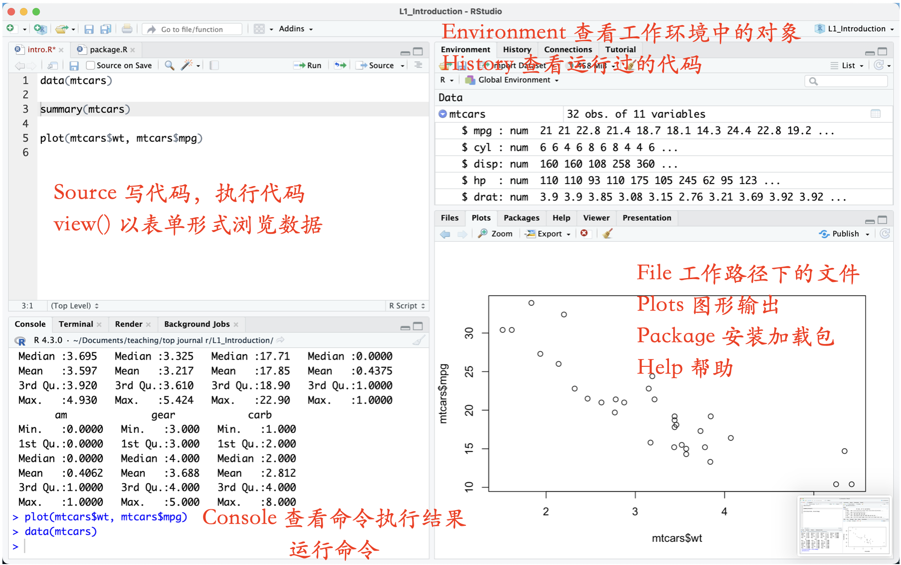
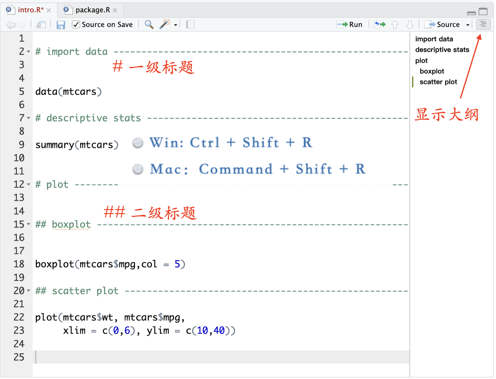
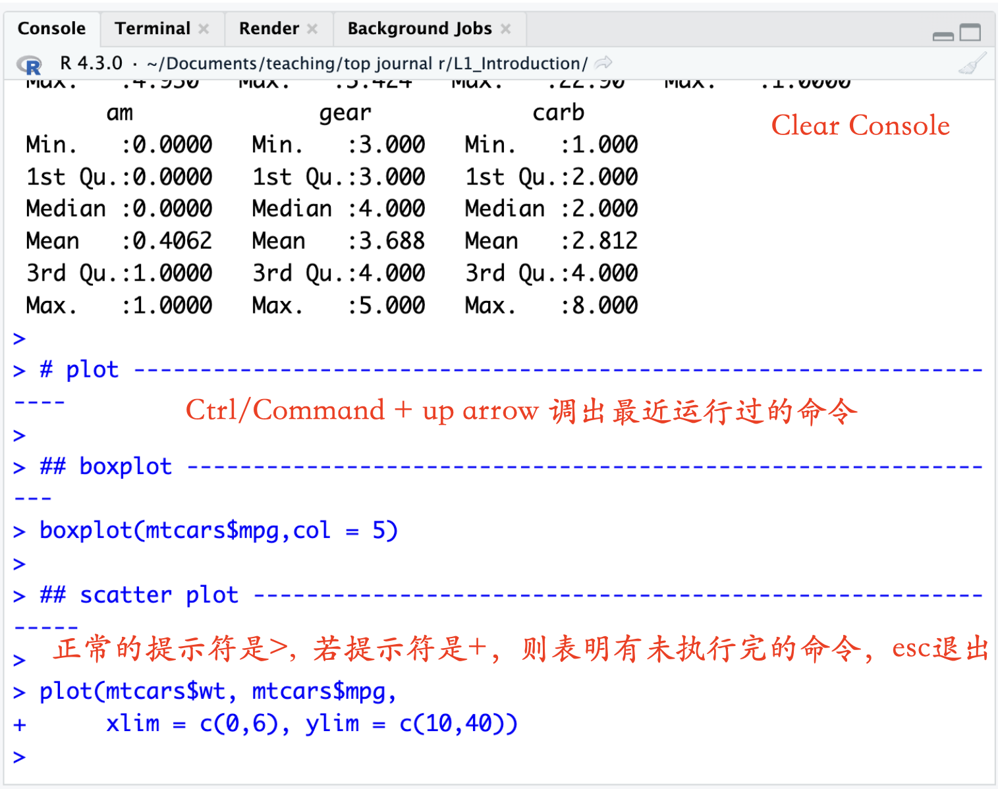
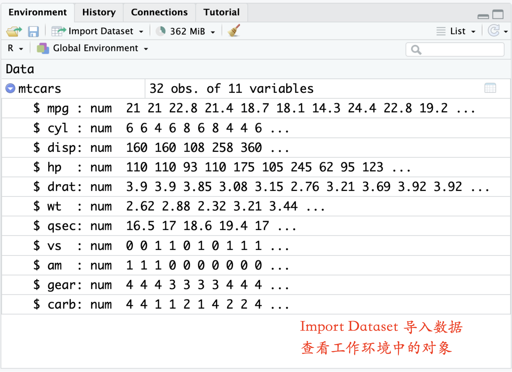
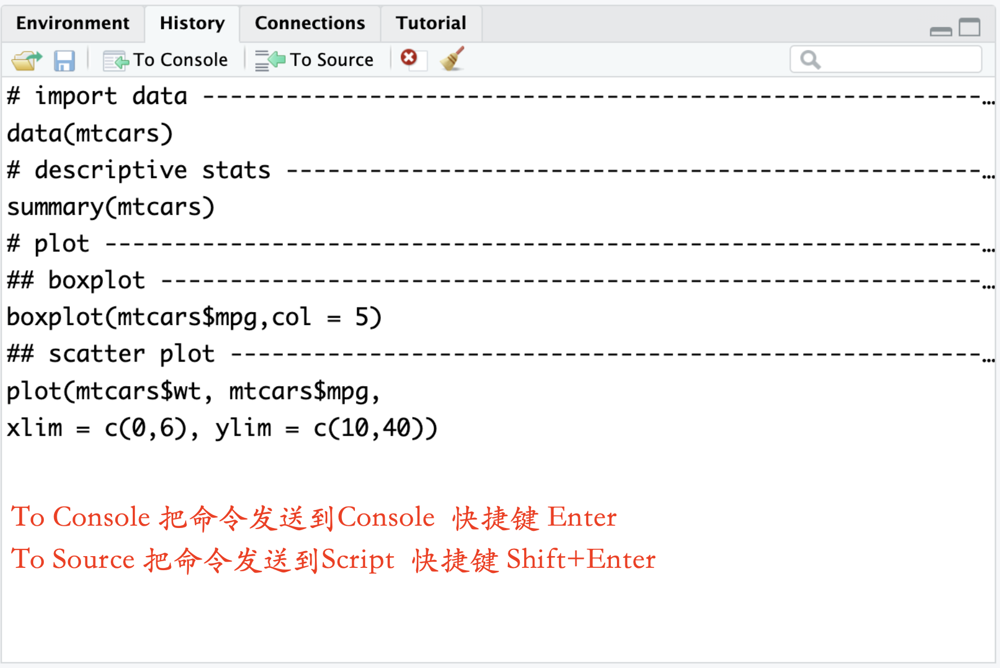
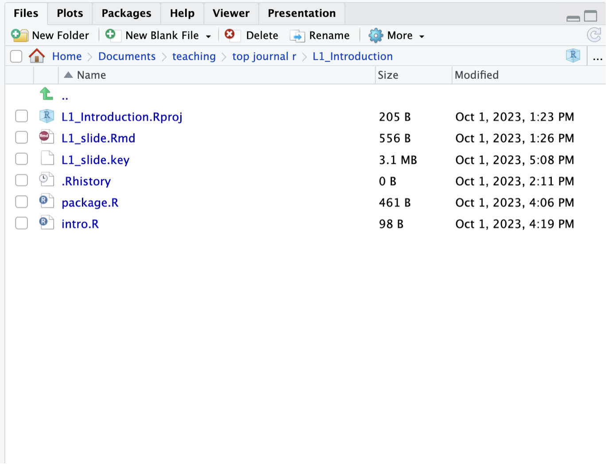
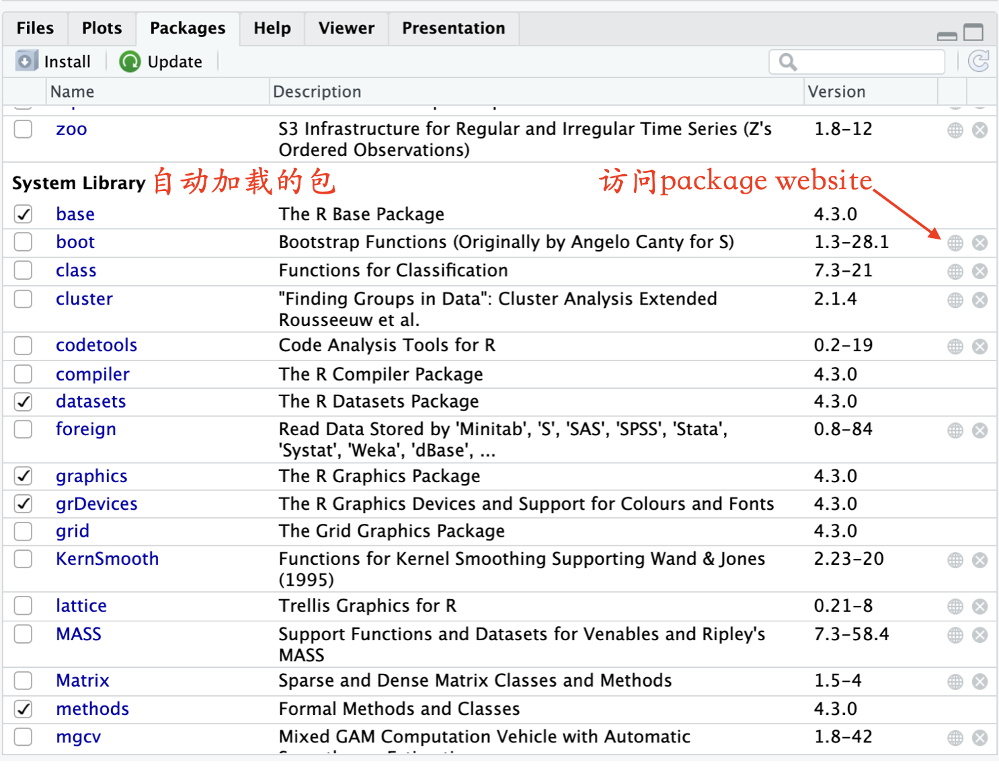
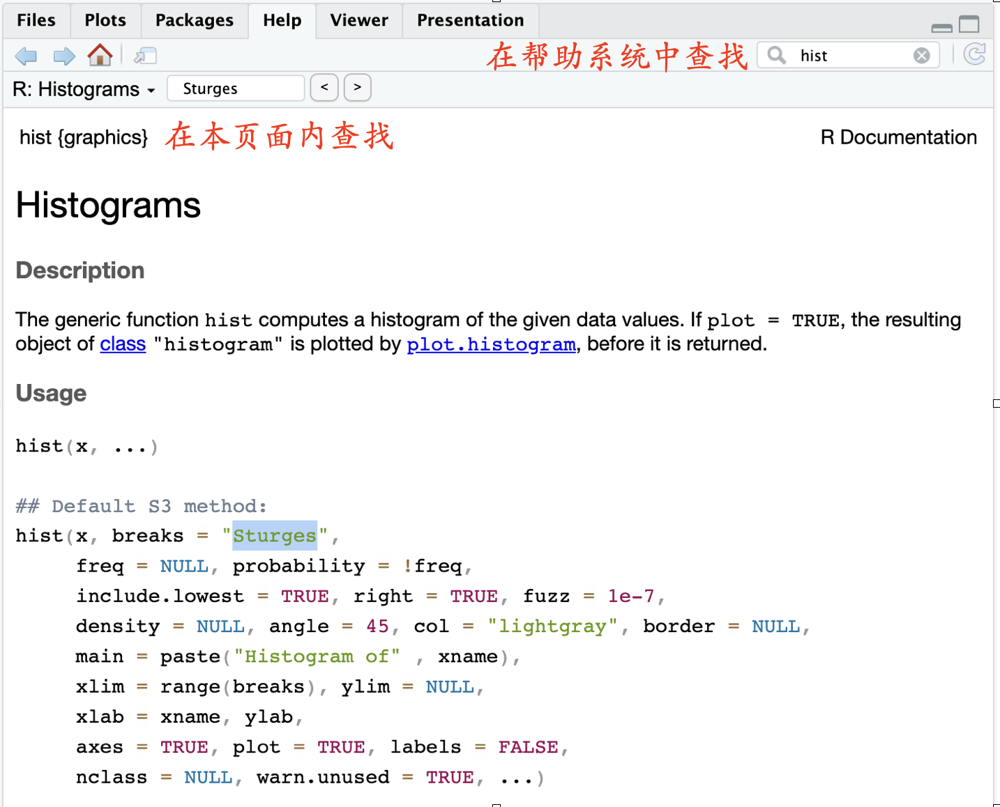

## 1 RStudio主界面



---

## 2 Source 脚本/代码窗口

### 执行代码

*   **Windows**: `Ctrl` + `Enter`
*   **Mac**: `Command` + `Enter`

::: {.callout-tip title="注意"}
直接按下 `Enter` 键只会将光标移至下一行，而**不会**运行当前命令。
:::

---

### 给代码添加注释

注释是代码中不被执行的部分，用于解释代码逻辑。

*   **符号**：使用 `#` 开头的行。
*   **用途**：记录笔记、解释参数含义或临时屏蔽某行代码。

---

### 不执行某些命令 

快速注释掉一段代码使其不执行

*   **Windows**: `Ctrl` + `Shift` + `C`
*   **Mac**: `Command` + `Shift` + `C`

---

### 给代码分节

增加可读性和大纲目录，方便跳转到某段代码。

*   **Windows**: `Ctrl` + `Shift` + `R`
*   **Mac**: `Command` + `Shift` + `R`



---

## 3 Console控制台



::: {.callout-important title="注意"}
在控制台直接修改代码无法保存至脚本文件。
:::

---

## 4 Environment & History 环境与历史



---




---

## 5 Files/Plots/Package/Help

### Files


---

### Packages



---

### Help



---

## 6 基础绘图:plot()

### 矩阵散点图

```{r}
#| echo: true
data(mtcars)
plot(mtcars)
```


---

### 散点图

```{r}
#| echo: true
plot(mtcars$wt, mtcars$mpg,    # 设置 X 轴(重量)与 Y 轴(油耗)
     col = "skyblue",          # 颜色：天蓝
     pch = 19,                 # 点型：实心圆
     cex = 1.5,                # 倍率：1.5倍大小
     las = 1,                  # 刻度：标签水平
     main = "Weight & MPG",    # 主标题
     xlab = "Weight (1000 lbs)",      # X轴标签
     ylab = "Miles/(US) gallon"       # Y轴标签
     )
```

---

### 分组箱线图

```{r}
#| echo: true
plot(as.factor(mtcars$cyl), mtcars$mpg,      # 转换为因子，绘制箱线图
     col = c("#8DA0CB", "#FC8D62", "#66C2A5"), # 分组填充颜色
     border = "gray40",                     # 边框深灰色
     las = 1,                               # 刻度数字水平显示
     main = "MPG Distribution by Engine Cylinders", # 标题内容
     xlab = "Number of Cylinders",          # X轴标签
     ylab = "Miles/(US) gallon",            # Y轴标签
     font.main = 2                          # 标题粗体
)
```


查看颜色代码：[https://htmlcolorcodes.com/](https://htmlcolorcodes.com/)

---

### 条形图

```{r}
#| echo: true
plot(as.factor(mtcars$cyl), 
     col = c("#8DA0CB", "#FC8D62", "#66C2A5"), 
     border = "gray50",                     # 边框微调为中灰，更柔和
     las = 1,                               # 刻度数字水平
     main = "Distribution of Cylinders",    # 标题
     xlab = "Number of Cylinders",          # X轴标签
     font.main = 2,                         # 标题加粗
     ylim = c(0, 15)                        #调整Y轴刻度范围
)
```

---

### 回归模型的诊断

```{r}
#| echo: true
#| fig-show: hold
model1 <- lm(mpg ~ wt + cyl + disp, data = mtcars) #估计回归模型
par(mfrow = c(2, 2))  # 设置 2x2 的布局
plot(model1)
par(mfrow = c(1, 1))  # 恢复默认布局（1x1）
```


---

### 函数图像

```{r}
#| echo: true
# 绘制正弦函数曲线，指定范围从 -2π 到 2π
plot(sin, -2*pi, 2*pi, 
     col = "skyblue", 
     lwd = 2, 
     main = "Sine Wave Form")
```

---

```{r}
#| echo: true
# 标准正态分布概率密度函数
plot(dnorm, from = -4, to = 4,
     main = "N(0,1) PDF",
     col = "skyblue", 
     lwd = 3)
```


     
--- 

::: {.callout-tip title="plot() 函数的强大之处"}
输入不同对象，它就能智能选择最合适的图形。
:::


