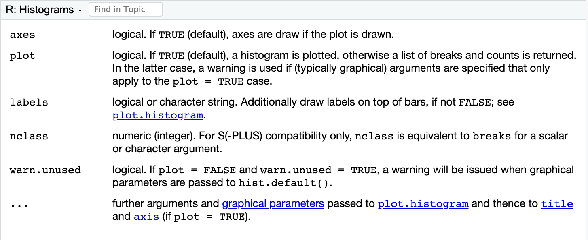
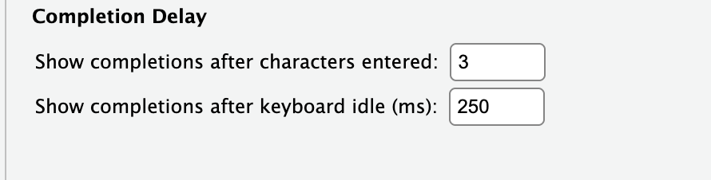

## 1 为什么要学习R的帮助文档？

- 最权威、最准确的R使用指南
- 很多专业函数在网络上很难找到教程
- AI 有时也会给出错误或过时的答案
- **掌握帮助文档 = 掌握自学R的能力**

## 2 查看帮助文档的几种方式

```{r}
?hist #精确查找

??hist #模糊查找

help(hist) #函数式调用
```

- 光标放在函数名上，按F1(Win)/ Fn + F1(Mac), 快速打开帮助。

- 在帮助窗口右上角可以搜索关键词

## 3 帮助文档的结构

| 部分            | 内容含义                              | 阅读优先级       |
|-----------------|---------------------------------------|------------------|
| **Title**       | 函数简短标题                          | ★☆☆             |
| **Description** | 函数功能描述                          | ★★★             |
| **Usage**       | 函数调用格式（语法）                  | ★★★★★           |
| **Arguments**   | 每个参数的详细解释（**最重要！**）    | ★★★★★           |
| **Details**     | 详细计算方法和注意事项                | ★★★★            |
| **Value**       | 函数返回的结果类型                    | ★★★★            |
| **See Also**    | 相关推荐函数（超级实用）              | ★★★★★           |
| **Examples**    | 官方示例代码（**最推荐看的部分**）    | ★★★★★           |

---

### 快速判断参数的重要性

**第一个参数**（通常是 `x`、`data` 等）—— **几乎总是必须填写**。

**有默认值的参数**（例如 `breaks = "Sturges"`、`col = "lightgray"`）—— **可以不写**，R 会自动使用默认值。

**初学者最值得关注的参数**：

   - **控制图形样子的**：`main`、`xlab`、`ylab`、`col`
   - **控制图形本质的**：`breaks`、`probability`

---

**其余大部分参数** —— 先使用默认值，等以后有需要时再深入了解。

::: {.callout-tip title="学习建议"}
**先保证能跑起来**（只写必要参数），**再逐步美化**（添加 `main`、`col`、`breaks` 等）, 深入细节。
:::

---

### example()官方示例

```{r}
#| echo: true
#| eval: false
example(boxplot) # 自动演示各种箱线图写法
```


## 4 理解函数的输入和输出


- 输入（Input） 

    - Usage：快速了解函数的基本调用格式
    - Arguments：详细查看每个参数的含义、类型和默认值

- 输出（Output）

    - Value：函数运行后返回什么类型的结果，如数值、数据框、图形对象等。

:::{.callout-note title="输入输出的核心概念"}
真正理解一个函数，不是记住所有参数，而是弄清楚：它需要什么输入？会产生什么输出？
:::

```{r}
#| echo: true
mpg_hist <- hist(mtcars$mpg, 
                 breaks = "Sturges", 
                 col = "lightgray", 
                 main = "MPG Distribution", 
                 xlab = "Miles Per Gallon")
```

---

```{r}
#| echo: true
mpg_hist          # 查看返回的对象
```

---

```{r}
#| echo: true
mpg_hist$counts   # 提取频数
mpg_hist$breaks   # 提取分隔点
```

- 运行函数 → 生成对象 → 提取属性 ($) → 进一步分析

--

## 5 阅读帮助文档的实用技巧

### 数据集也有帮助文档

```{r}
#| echo: true
?mtcars
```

----

### 帮助函数中的跳转



---

### Find in Topic 页面内搜索

```{r}
#| echo: true
?par
```

---

### par {graphics}



> 任何一个高级绘图函数（比如 plot()、hist()、boxplot()、barplot() 等），都可以接受很多图形参数（<tag> = <value>）。

> <tag> = 参数名称（如 col、pch、main、cex、las 等）

> <value> = 参数的具体值（如 "red"、19、"主标题"、1.5、0 等）

---

### 为什么有时搜不到帮助文档？

- 原因：函数所在的包没有被加载。

```{r}
#| echo: true
library(corrplot) # 先加载包
?corrplot
```


:::{.callout-note title="Tips"}
如果实在记不住包名，使用双问号 ??corrplot 进行全局搜索，找到包名后再加载。
:::

---

### Vignettes 包的官方教程文档

- HTML

- source

- R code


